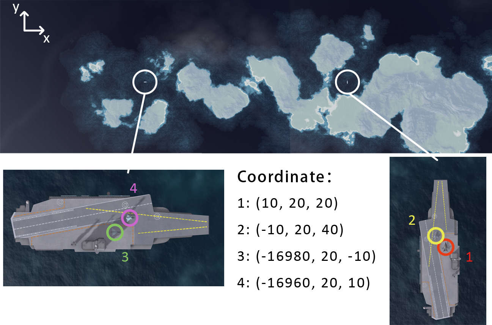
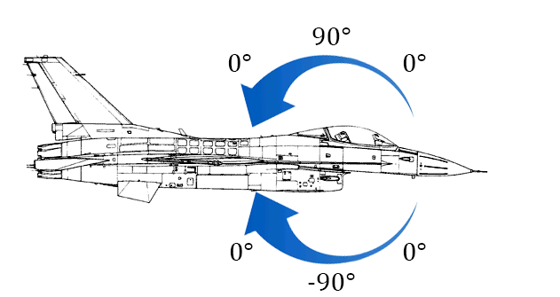
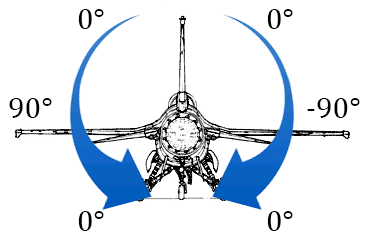
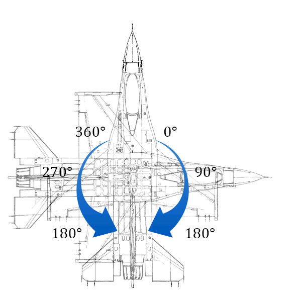

## df.get_plane_state(self.planeID)

Return a `dict`

Example: {'timestamp': 103981, 'timestep': 0.016666666666666666, 'position': [7.842685222625732, 19.442346572875977, 104.7667007446289], 'Euler_angles': [0.0, -0.23409990966320038, 0.0], 'easy_steering': True, 'health_level': 1, 'destroyed': False, 'wreck': False, 'crashed': False, 'active': True, 'type': 'AICRAFT', 'nationality': 1, 'thrust_level': 1, 'brake_level': 0, 'flaps_level': 0, 'horizontal_speed': 56.026527404785156, 'vertical_speed': -0.5931200385093689, 'linear_speed': 56.029666900634766, 'move_vector': [-3.7959580421447754, -0.5931200385093689, 55.897789001464844], 'linear_acceleration': 1.3036510467529325, 'altitude': 19.442346572875977, 'heading': 346.5870820059287, 'pitch_attitude': 0.0, 'roll_attitude': 0.0, 'post_combustion': False, 'user_pitch_level': 0.0, 'user_roll_level': 0.0, 'user_yaw_level': -1.0, 'gear': True, 'ia': False, 'autopilot': False, 'autopilot_heading': 0, 'autopilot_speed': -1, 'autopilot_altitude': 500, 'target_id': '', 'target_locked': False}

## df.getplane_state(self.planeID)['position']

Return a `list[3]=[x, z, y]`, which is the position of plane *planeID*. The coordinate system is shown in the following figure.

## df.getplane_state(self.planeID)['pitch_attitude']

Return a `float` (degree). The value is shown in the following figure.

## df.getplane_state(self.planeID)['roll_attitude']

Return a `float` (degree). The value is shown in the following figure. **This is not a bijection.**

## df.getplane_state(self.planeID)['heading']

Return a `float` (degree). The value is shown in the following figure.

## df.getplane_state(self.planeID)['horizontal_speed']

Return a `float`. This value is always positive.

## df.getplane_state(self.planeID)['vertical_speed']

Return a `float`. 

## df.getplane_state(self.planeID)['linear_speed']

Return a `float`. This value equals to the geometric Mean of 'horizontal_speed' and 'vertical_speed'

